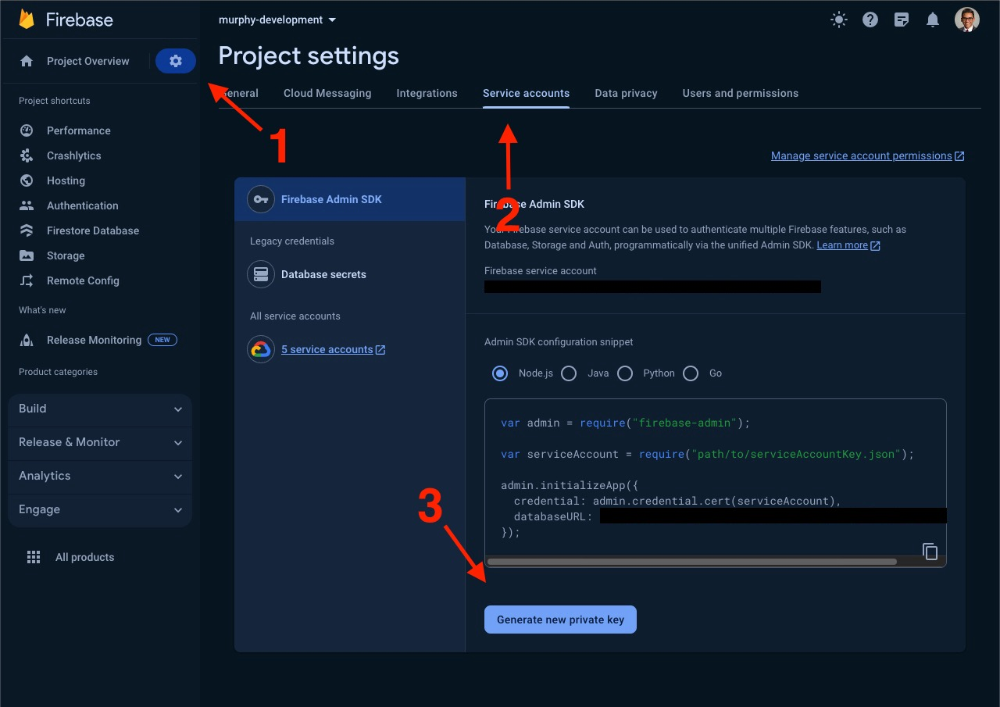

# Murphy E-commerce Backend

This repository contains the backend server for an e-commerce application built with Express.js and Firestore.

# Getting Started

## Prerequisites

- Node.js
- npm or yarn
- Firebase account

# Installation

1. Clone the repository:

```
git clone https://github.com/4human-org/murphy-ecommerce-backend.git
```

2. Navigate to the project directory:

```
cd ecommerce-backend
```

3. Install dependencies:

```
npm install
```

4. Set up your Firebase Firestore:

- Go to the Firebase Console
- Create a new project or use an existing one
- Navigate to Project settings > Service accounts
- Generate a new private key and download the JSON file



5. Create a .env file in the root of the project directory and add the following environment variables from your firebase service account keys:

```
FIREBASE_PROJECT_ID=murphy-development
FIREBASE_PRIVATE_KEY=  # Insert your private key here
FIREBASE_CLIENT_EMAIL= # Insert your client email here
```
6. Make sure the Firestore database is configured correctly.

## Running the Server

Start the server with the following command:
```
nodemon app.mjs
```

## API Documentation

For a quick view of the API's structure and endpoints, run the API and visit "/api-docs" endpoint. This will pull up the Swagger UI.